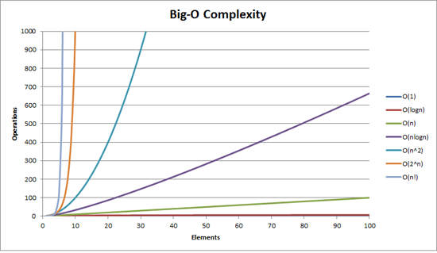

# Big O Notation

[Cheatsheet](https://www.bigocheatsheet.com/)

Big O notation defines how long it takes an algorithm to run, also called time complexity. It represents how long the runtime for a given algorithm can be as the data grows larger.

Big O specifically describes the worst-case scenario, and can be used to describe the execution time required or the space used (e.g. in memory or on disk) by an algorithm.

### O(1)
Constant Time
O(1) describes an algorithm that will always execute in the same time (or space) regardless of the size of the input data set.

### O(n)
Linear Time
O(N) describes an algorithm whose performance will grow linearly and in direct proportion to the size of the input data set.

### O(n^2)
Quadratic Time
Here we're nesting two loops. If our array has n items, our outer loop runs n times and our inner loop runs n times for each iteration of the outer loop.

